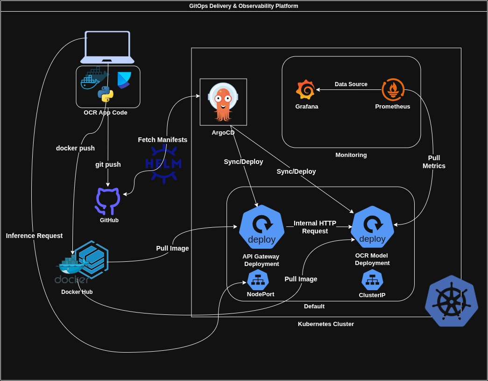

# OCR Inference Platform

This is a production-grade OCR (Optical Character Recognition) system designed to run on Kubernetes. It uses a FastAPI gateway to handle image uploads and a KServe-based model server for high-performance text extraction using the Tesseract engine.

## 🏗️ Architecture Overview

The system is built with a microservices approach, focusing on GitOps and full observability:

- API Gateway (FastAPI): The entry point for users. It manages incoming image files and coordinates with the back-end model.
- OCR Model Server (KServe): A specialized service that wraps the OCR logic, exposing both an inference API and Prometheus metrics on port 8080.
- GitOps (ArgoCD): Manages the state of the cluster. Any changes pushed to this repository are automatically deployed.
- Monitoring Stack: A pre-configured Prometheus and Grafana setup that tracks requests, latency, and hardware resource usage.




### 1. Prerequisites

Make sure you have the following installed:
- Minikube (Recommended settings: 4GB RAM, 2 CPUs)
- Docker
- kubectl
- Helm

### 2. Clone the Project

```
git clone [https://github.com/suran-sandeepa/ocr-devops-assignment.git](https://github.com/suran-sandeepa/ocr-devops-assignment.git)
cd ocr-devops-assignment
```

### 3. Setup Infrastructure

This script handles the heavy lifting—starting Minikube and installing ArgoCD, Prometheus, and Grafana via Helm.
```
bash scripts/infra_setup.sh
```

### 4. Build and Push Images

Build your Docker images and push them to your private repository.
```
bash scripts/build_images.sh
```
### 5. Deploy the Application

Apply the ArgoCD manifest. This will trigger the automated deployment of the gateway and model services.

```
kubectl apply -f argocd-app.yaml
```

### 6. Start the Demo

Run the provided demo script to open all necessary port-forwards and see your access credentials.

```
bash scripts/demo_start.sh
```


