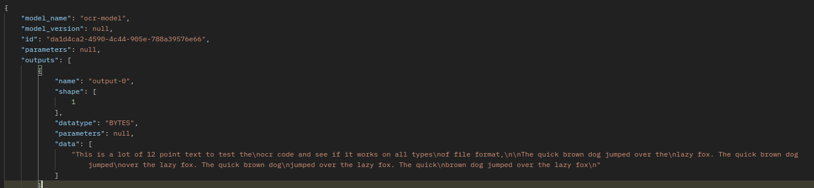
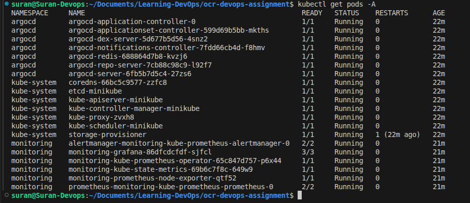
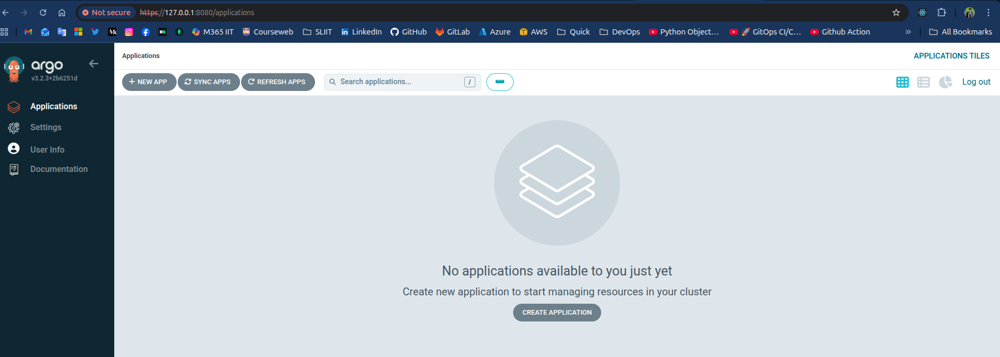
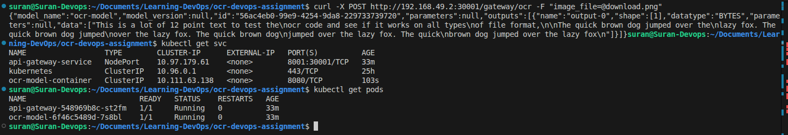
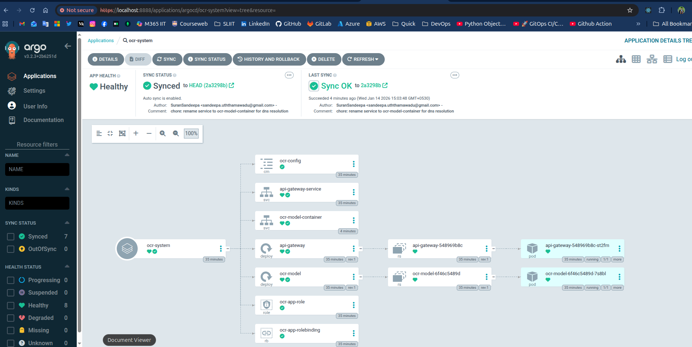
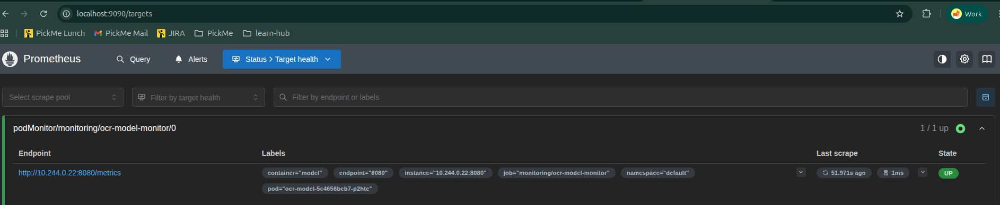
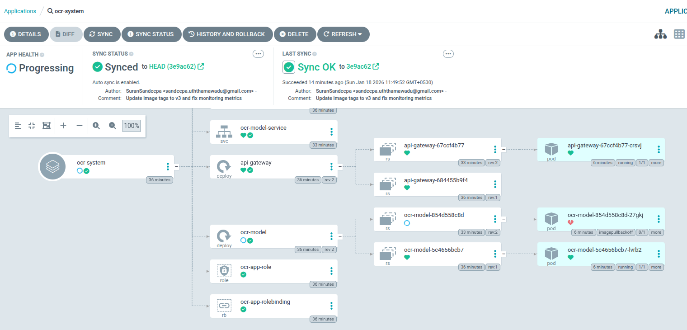
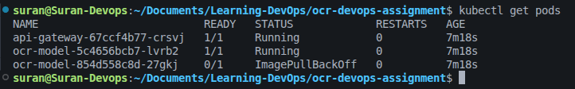

# OCR Inference Platform


# 01) Local Development 

The project began with setting up the development environment on Ubuntu. The core objective was to get the KServe model service and the FastAPI gateway talking to each other locally before moving to containers.

## 1.1) System Dependencies Installation
The OCR service relies on the Tesseract engine to perform text extraction from images.

```
# Update package list and install Tesseract OCR engine
sudo apt update
sudo apt install -y tesseract-ocr libtesseract-dev
```

## 1.2) Python Environment Setup
The project uses Poetry for deterministic dependency management.

```
# Install Poetry using the official installer
curl -sSL https://install.python-poetry.org | python3 -

# Add Poetry to the system path (if not automatically added)
export PATH="$HOME/.local/bin:$PATH"

# Reload shell config
source ~/.bashrc

# Verify Poetry now works
which poetry
poetry --version

-s → silent (no progress bar)
-S → show errors if they happen
-L → follow redirects
```

## 1.3) OCR Model Service Initialization

To prepare the environment and dependencies for the KServe model. \
/ocr-devops-assignment/ocr-model

```
# Attempted installation (Initially failed)
poetry install

# Error encountered: 
# "Readme path ... README.md does not exist."
# Reason: Poetry expects a README file for packaging by default.

# Resolution:
touch README.md
poetry install --no-root

# Start the service
poetry run python model.py

```

## 1.4) API Gateway Service Initialization

To prepare the FastAPI gateway that handles external image uploads. \
ocr-devops-assignment/api-gateway

```
# Prepare environment
touch README.md
poetry install --no-root

# Start the service
poetry run python api-gateway.py
```

## 1.5) Connectivity Configuration & Troubleshooting

Resolving service-to-service communication errors.

Error Encountered in Postman: Max retries exceeded with url: /v2/models/ocr-model/infer (Caused by NameResolutionError)

The code was configured to look for a Docker container named ocr-model-container. Changed the KSERVE_URL in api-gateway.py from http://ocr-model-container:8080/... to http://localhost:8080/....

## 1.6) Functional Testing

Postman Configuration:
Method: POST
URL: http://localhost:8001/gateway/ocr
Body Type: form-data
Key: image_file



# 02) Containerization
After verifying the code locally, the next phase involved packaging the applications into Docker images. This process ensures that the services run consistently across different environments (Development, Staging, and Production) by bundling the code, runtime, and system-level dependencies together.

## 2.1) Dockerfile Design Strategy
I wrote two Dockerfiles.one for the API Gateway and one for the OCR Model.

I used a Multi-stage build. This means I used one "builder" stage to install all the heavy libraries (like Poetry) and a second "final" stage to keep only the necessary files.

This made my images much smaller and faster.

I also added a Non-Root user (called worker) for security. This ensures that if someone hacks the app, they don't have "root" access to my whole system.
## 2.2) Automation with Bash Scripting
To streamline the build and deployment process, a bash script named build_images.sh was created in the scripts/ directory. This script automates several manual steps:

Configuration Patching: It automatically updates the api-gateway.py to use the internal Docker container name (ocr-model-container) instead of localhost.

Resource Cleanup: It stops and removes any existing containers and clears port 8001 to prevent "address already in use" errors.

Image Construction: It builds both images using absolute paths to ensure the script can be run from any directory.

Network Orchestration: It creates a dedicated Docker bridge network (ocr-network) to allow the two containers to communicate via DNS.

## 2.3) Troubleshooting & Resolution
While I was testing, I hit a common problem: Port 8001 was already in use. This happened because my local Python service from Phase 1 was still running.
I added a "killer" command to my script: ```fuser -k 8001/tcp```.

This command finds whatever is using that port and stops it immediately before I try to start my Docker container.

## 2.4) Image Distribution
To prepare for Kubernetes deployment, the local images were tagged and pushed to a remote repository on Docker Hub. This makes the images accessible to the Minikube cluster.

# 03) Infrastructure Setup
With the application successfully containerized and images pushed to the cloud, the focus shifted to building a production-grade platform. This phase involved setting up a local Kubernetes cluster and deploying industry-standard tools for GitOps (ArgoCD) and Observability (Prometheus & Grafana) using the Helm package manager.

## 3.1) Kubernetes Cluster Orchestration
I used Minikube to create a local Kubernetes cluster on my laptop. Because I knew I would be running heavy tools like ArgoCD and Prometheus, I didn't use the default settings. I specifically provisioned the cluster with 4096MB of RAM and 2 CPUs using the Docker driver.

## 3.2) Automated Infrastructure with Helm
Instead of writing hundreds of lines of manual YAML files, I used Helm, which is the package manager for Kubernetes. Helm allowed me to treat my infrastructure as code by using "Charts" (pre-packaged blueprints).

Repository Syncing: It connects to the official public Helm repositories for Argo (argoproj) and the Prometheus community to pull the latest tool versions.

Idempotent Deployment: I used the helm upgrade --install command. This is a "pro-move" because it means the script is re-runnable; it will install the tools if they are missing or update them if I change a setting, without ever failing because a resource "already exists."

Resource Optimization: I used the --set flag to override default memory limits. This was critical for a local laptop setup to prevent Prometheus and ArgoCD from consuming all available system memory.
## 3.3) Tooling & Observability Stack

I organized my cluster by using Namespaces, which act like virtual folders to keep different tools isolated and clean.

ArgoCD: I installed this in the argocd namespace. It is my GitOps engine. It stays connected to my GitHub repository; whenever I push a change to my code, ArgoCD sees it and automatically "syncs" the cluster to match the new state.

Prometheus: I deployed this to act as the "database" for my system's health. It "scrapes" (collects) real-time numbers and metrics from my OCR model and storage.

Grafana: I deployed this to be the visual layer. It connects to Prometheus and turns raw numbers into the charts and graphs I used in the final dashboard.

# 04) Kubernetes Deployment

I transitioned from infrastructure setup to Application Deployment. This is where I created the "Blueprints" for my OCR system. Instead of writing static YAML files, I built a dynamic Helm Chart that allows the entire application to be configured from a single file.















Kubernetes won't kill my "old" working pods until the "new" v3 pods are healthy. Because the v3 pod is stuck with an image error, Kubernetes is keeping the old ones alive so my app doesn't go completely offline.


