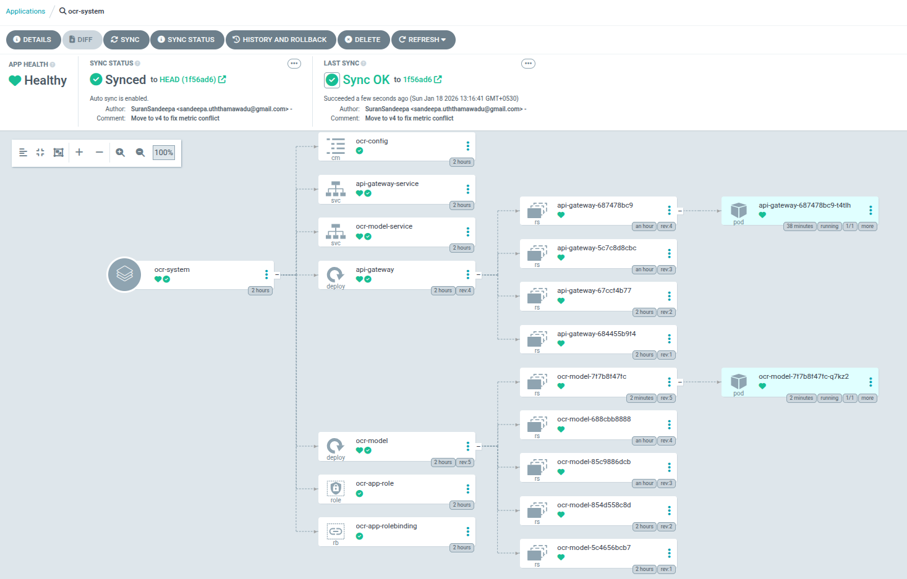
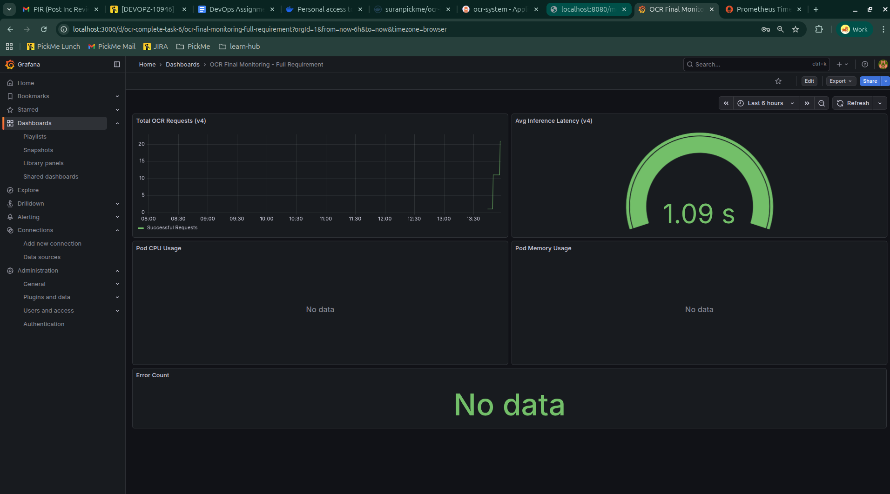

# OCR Inference Platform
This project is a production-grade OCR (Optical Character Recognition) platform. It uses a FastAPI gateway to handle image uploads and a KServe-based model server to perform text extraction using Tesseract. The entire stack is deployed using GitOps principles and monitored with a professional Prometheus/Grafana stack.


# 01) Local Development 

The project began with setting up the development environment on Ubuntu. The core objective was to get the KServe model service and the FastAPI gateway talking to each other locally before moving to containers.

## 1.1) System Dependencies Installation
The OCR service relies on the Tesseract engine to perform text extraction from images.

```
sudo apt update
sudo apt install -y tesseract-ocr libtesseract-dev
```

## 1.2) Python Environment Setup
I used Poetry for deterministic dependency management to ensure "it works on my machine" means "it works everywhere."

```
curl -sSL [https://install.python-poetry.org](https://install.python-poetry.org) | python3 -
export PATH="$HOME/.local/bin:$PATH"
```

## 1.3) OCR Model Service Initialization

To prepare the environment and dependencies for the KServe model. \
/ocr-devops-assignment/ocr-model

```
# Attempted installation (Initially failed)
poetry install

# Error encountered: 
# "Readme path ... README.md does not exist."
# Reason: Poetry expects a README file for packaging by default.

# Resolution:
touch README.md
poetry install --no-root

# Start the service
poetry run python model.py

```

## 1.4) API Gateway Service Initialization

To prepare the FastAPI gateway that handles external image uploads. \
ocr-devops-assignment/api-gateway

```
# Prepare environment
touch README.md
poetry install --no-root

# Start the service
poetry run python api-gateway.py
```

## 1.5) Connectivity Configuration & Troubleshooting

Resolving service-to-service communication errors.

Error Encountered in Postman: Max retries exceeded with url: /v2/models/ocr-model/infer (Caused by NameResolutionError)

The code was configured to look for a Docker container named ocr-model-container. Changed the KSERVE_URL in api-gateway.py from http://ocr-model-container:8080/... to http://localhost:8080/....

## 1.6) Functional Testing

Postman Configuration:
Method: POST
URL: http://localhost:8001/gateway/ocr
Body Type: form-data
Key: image_file


# 02) Containerization
After verifying the code locally, the next phase involved packaging the applications into Docker images. This process ensures that the services run consistently across different environments (Development, Staging, and Production) by bundling the code, runtime, and system-level dependencies together.

## 2.1) Dockerfile Design Strategy
I wrote two Dockerfiles.one for the API Gateway and one for the OCR Model.

- Multi-stage Builds: I used a "builder" stage for heavy dependencies and a "slim" final stage. This kept the images lightweight.
- Security: I added a non-root user (worker) to run the application, following the principle of least privilege.
- Automation: I wrote build_images.sh to handle patching the code for Docker networking, building the images, and pushing them to my private Docker Hub repo.

## 2.3) Troubleshooting & Resolution
While I was testing, I hit a common problem: Port 8001 was already in use. This happened because my local Python service from Phase 1 was still running.
I added a "killer" command to my script: ```fuser -k 8001/tcp```.

This command finds whatever is using that port and stops it immediately before I try to start my Docker container.

# 03) Infrastructure Setup

## 3.1) Kubernetes Cluster Orchestration
I used Minikube to create a local Kubernetes cluster on my laptop. Because I knew I would be running heavy tools like ArgoCD and Prometheus, I didn't use the default settings. I specifically provisioned the cluster with 4096MB of RAM and 2 CPUs using the Docker driver.

## 3.2) Automated Infrastructure with Helm
Instead of writing hundreds of lines of manual YAML files, I used Helm, which is the package manager for Kubernetes. Helm allowed me to treat my infrastructure as code by using "Charts" (pre-packaged blueprints).

- Repository Syncing: It connects to the official public Helm repositories for Argo (argoproj) and the Prometheus community to pull the latest tool versions.
- Idempotent Deployment: I used the helm upgrade --install command. This is a "pro-move" because it means the script is re-runnable; it will install the tools if they are missing or update them if I change a setting, without ever failing because a resource "already exists."
- Resource Optimization: I used the --set flag to override default memory limits. This was critical for a local laptop setup to prevent Prometheus and ArgoCD from consuming all available system memory.

## 3.3) Tooling & Observability Stack

I organized my cluster by using Namespaces, which act like virtual folders to keep different tools isolated and clean.

- ArgoCD: I installed this in the argocd namespace. It is my GitOps engine. It stays connected to my GitHub repository; whenever I push a change to my code, ArgoCD sees it and automatically "syncs" the cluster to match the new state.

- Prometheus: I deployed this to act as the "database" for my system's health. It "scrapes" (collects) real-time numbers and metrics from my OCR model and storage.

- Grafana: I deployed this to be the visual layer. It connects to Prometheus and turns raw numbers into the charts and graphs I used in the final dashboard.

# 04) Kubernetes Deployment & GitOps

After setting up the infrastructure, it was time to move the application onto the cluster. Instead of writing separate YAML files for everything, I built a dynamic Helm Chart. This allows me to manage the whole system—Gateway, Model, and Services—from one single place.

## 4.1) Helm Chart Architecture

I created a chart named ocr-app inside the charts/ directory. I used templates for the Deployments and Services, which get their settings from a central values.yaml file. This makes it really easy to change things like image versions or port numbers without touching the core code.

## 4.2) Managing Private Images

Since my images are stored in a private Docker Hub repository, I had to give Kubernetes "keys" to the front door. I created an image pull secret so the cluster could safely download the images.

```
# Creating the secret so Kubernetes can pull from my private Docker Hub
kubectl create secret docker-registry regcred \
  --docker-server=[https://index.docker.io/v1/](https://index.docker.io/v1/) \
  --docker-username=<your-username> \
  --docker-password=<your-password> \
  --docker-email=<your-email>
```

## 4.3) Deploying with ArgoCD

I used ArgoCD to handle the actual deployment. I created an application manifest (argocd-app.yaml) that points to my GitHub repo. The best part about this GitOps approach is that the moment I push a change to GitHub, ArgoCD wakes up and automatically updates the cluster to match.

```
# Applying the ArgoCD application manifest to start the sync
kubectl apply -f argocd-app.yaml
```


# 05) Troubleshooting

This was probably the most challenging part of the project. When I tried to update to version 3 of my model, the pods wouldn't stay running. They kept showing a CrashLoopBackOff error.

## 5.1) Investigating the Logs

I had to play detective. I checked the logs of the crashing pod to see what was happening inside.

```
# Checking the logs to see why the pod was dying
kubectl logs <pod-name>
```
The Error: ```ValueError: Duplicated timeseries in CollectorRegistry: {'request_predict_seconds'}```

It turned out that KServe (the library I used) already had a metric named request_predict_seconds built-in. My code was trying to create a new metric with the exact same name. Python hated this "double-booking" and crashed the app immediately.

## 5.2) The Fix: Moving to Version 4

To fix this, I renamed my custom metrics in model.py to something unique like ocr_v4_total. I also performed a "No-Cache" build to make 100% sure Docker didn't accidentally keep using the old, broken code.

```
# Building the fixed version without using any old cached layers
docker build --no-cache -t suranpickme/ocr-inference-platform:ocr-model-v4 .
docker push suranpickme/ocr-inference-platform:ocr-model-v4
```

Kubernetes won't kill my "old" working pods until the "new" v3 pods are healthy. Because the v3 pod is stuck with an image error, Kubernetes is keeping the old ones alive so my app doesn't go completely offline.




# 06) Monitoring Setup

The final phase was about visibility. If the model starts running slowly or failing, I need to know before the users do.

## 6.1) Connecting Prometheus to the Model

I created a PodMonitor. Think of this as a set of instructions for Prometheus. It tells Prometheus: "Go check the OCR pods on port 8080 every 15 seconds and grab their latest numbers."

## 6.2) Visualizing the Results in Grafana

I set up a port-forward to access my Grafana dashboard and imported a custom JSON configuration that I built specifically for this OCR app.

```
# Opening the tunnel to Grafana
kubectl port-forward svc/monitoring-grafana -n monitoring 3000:80
```

The dashboard now tracks four critical areas:
- Total Requests: How many images have been processed.
- Resource Usage: Real-time CPU and Memory consumption (Requirement 3b).
- Inference Latency: A gauge showing how many seconds the OCR takes (Requirement 3c).
- Error Rate: A counter for "status=error" requests (Requirement 3d).

## 6.3) The Final Test

To see if the graphs actually moved, I ran a stress test by sending 10 images in a loop.
```
# Sending 10 requests rapidly to see the spike in Grafana
for i in {1..10}; do 
  curl -X POST http://$(minikube ip):30001/gateway/ocr -F "image_file=@test.jpg"
done
```





# 07) How to Run the Project

## 1. Prerequisites

Ensure you have Docker, Minikube, and Kubectl installed.

## 2. Infrastructure Setup

Run the setup scripts to prepare the cluster:
```
bash scripts/setup_infra.sh
```

## 3. Build and Push

Build your images and push them to your repository:
```
bash scripts/build_images.sh
```

## 4. Deploy

Apply the ArgoCD application to start the automated sync:
```
kubectl apply -f k8s/argocd-app.yaml
```

## 5. Launch Demo

Use the provided demo script to open all necessary tunnels and get the login credentials:
```
bash scripts/demo_start.sh
```

## 6. Test

Send an image to the gateway:
```
curl -X POST http://localhost:8001/gateway/ocr -F "image_file=@test.jpg"
```